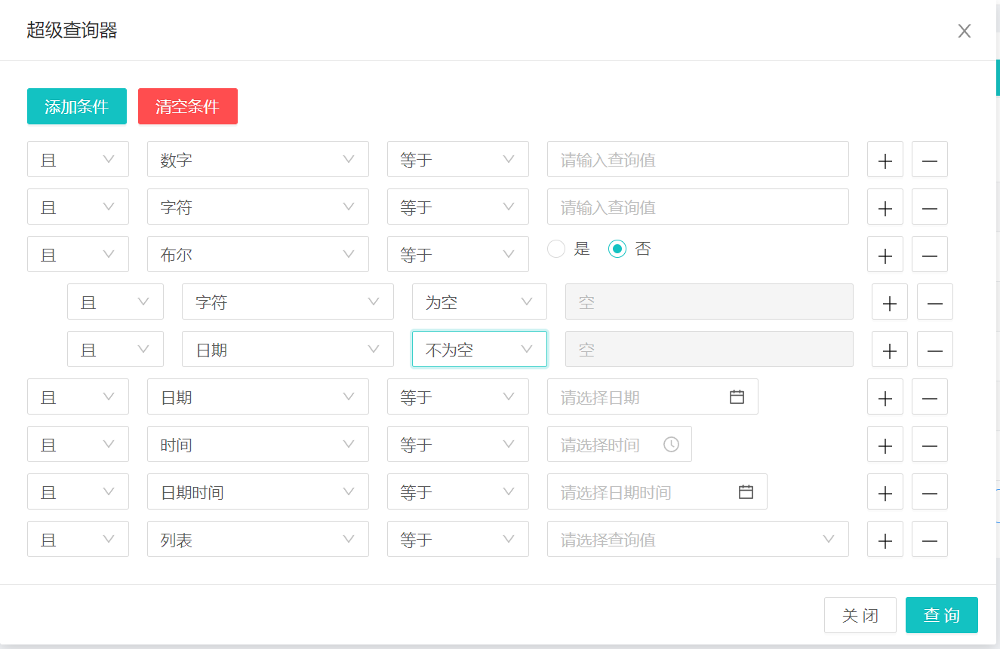

# 超级查询器

**超级查询器使用效果**

在要进行查询的页面引入超级查询器组件，并放在合适的位置上
导入语句：`import BSuperQuery from '@/components/Bootx/SuperQuery/BSuperQuery'`

```vue
<b-super-query
  :queryState="superQueryFlag"
  :fields="queryFields"
  :width="880"
  button-title="超级查询"
  model-title="超级查询器"
  @query="superQuery"
  @reset="resetQuery"
/>
```

组件对应的各项参数：

- `queryState`：查询状态，当前是否在进行查询
- `fields`：查询配置参数
- `width`：宽度
- `button-title`：按钮标题
- `model-title`：弹框标题
- `@query`：点击查询时的回调
- `@rest`：点击取消查询时的回调

** **`**fields**`**查询配置参数**
示例
```javascript
[
  { field: 'num', name: '数字', type: NUMBER, precision: 2 },
  { field: 'string', name: '字符', type: STRING },
  { field: 'bool', name: '布尔', type: BOOLEAN },
  { field: 'date', name: '日期', type: DATE },
  { field: 'time', name: '时间', type: TIME },
  { field: 'date_time', name: '日期时间', type: DATE_TIME },
  { field: 'list',
   name: '列表',
   type: LIST,
   list:
   [
     { label: '测试1', value: 'cs1' },
     { label: '测试2', value: 'cs2' },
     { label: '测试3', value: 'cs3' }
   ] }
]
```

- `field`：查询字段名，对应的数据库查询字段名称，提交时会作为查询参数传送到后台
- `name`：显示名称，查询器查询页面显示的查询字段名称，不会被提交
- `type`：数据类型，根据传入不同的的数据类型，使用不同的组件进行查询，对应后端`ParamTypeEnum` 枚举
- `underLine`：参数名称是否需要转换成下划线命名，默认转换
- `valueFormat` : type数据类型为日期时间类型时可用，绑定值的格式，默认为 `yyyy-MM-DD HH:mm:ss` / `yyyy-MM-DD` / `HH:mm:ss`类型的样式
- `precision` : type数据类型为number时可用，表示小数点位数，默认为0位
- `list`：type数据类型为list的时候，通过这个字段传入
   - `label`：显示名称
   - `value`：查询的值，等同`field`
- 


**数据类型（type）**
可以引入`import BSuperQuery from '@/components/Bootx/SuperQuery/superQueryCode'`中的类型常量值进行配置，所支持的类型如下
```javascript
// 数字
export const NUMBER = 'number'
// 字符串
export const STRING = 'string'
// 布尔
export const BOOLEAN = 'boolean'
// 日期
export const DATE = 'date'
// 时间
export const TIME = 'time'
// 日期时间
export const DATE_TIME = 'date_time'
// 列表
export const LIST = 'list'
```
**@query查询回调**
```javascript
// 传入查询参数, queryParams 对应的是后端QueryParams对象
function (queryParams) {
  
}
```
**@reset取消回调**
回调函数没有参数，是个空参方法，用于重置查询参数
# 普通查询器

**普通查询器使用效果**
导入语句：`import BQuery from '@/components/Bootx/SuperQuery/BQuery'`
```vue
<b-query
  v-model="queryParam"
  :fields="fields"
  :gutter="10"
  :disabled-query="true"
  :default-item-count="2"
  :default-item-md="6"
  @query="query"
  @reset="() => queryParam = {}"
/>
```
组件对应的各项参数：

- `v-model` 查询参数对象
- `fields`查询字段配置列表，通过传入的数据构建成查询器，根据其中的设置将值赋到查询参数对象上
- `gutter` 查询条目之间间隔数
- `default-item-md` 每个查询项所占的栅格数，可以通过这个参数来设置，默认为6，会被字段配置中的参数覆盖
- `default-item-count` 默认展示出几个查询项，超过的将会被隐藏，需要点击展开来进行使用，默认展示2个
- `default-item-count` 是否禁用查询，禁用查询后，查询按钮变为不可用，通常配合超级查询器进行使用
- `@query`：点击查询时的回调
- `@rest`：点击取消查询时的回调


`**fields**`**查询配置参数**
```javascript
[
  { field: 'num', name: '数字', type: NUMBER, precision: 2 },
  { field: 'string', name: '字符', type: STRING, placeholder: '请输入表单名称' },
  { field: 'bool', name: '布尔', type: BOOLEAN, md: 12 },
  { field: 'date', name: '日期', type: DATE },
  { field: 'time', name: '时间', type: TIME },
  { field: 'date_time', name: '日期时间', type: DATE_TIME },
  { field: 'list',
   name: '列表',
   type: LIST,
   list:
   [
     { lable: '测试1', value: 'cs1' },
     { lable: '测试2', value: 'cs2' },
     { lable: '测试3', value: 'cs3' }
   ] }
]
```
参数说明：

- `field`：查询字段名
- `name`：显示名称，查询器查询页面显示的查询字段名称
- `type`：数据类型，根据传入不同的的数据类型，会使用不同的组件
- `placeholder`：提示文本
- `md`：查询项对应占用的栅格数，会覆盖默认配置的`item-md`配置
- `precision` : type数据类型为number时可用，表示小数点位数，默认为0位
- `list`：type数据类型为list的时候，通过这个字段传入
   - `lable`：显示名称
   - `value`：查询的值，等同`field`

**数据类型（type）**
与超级查询器一致

**@query查询回调**
回调函数没有参数，是个空参方法，用于发起查询

**@reset取消回调**
回调函数没有参数，是个空参方法，用于重置查询参数
