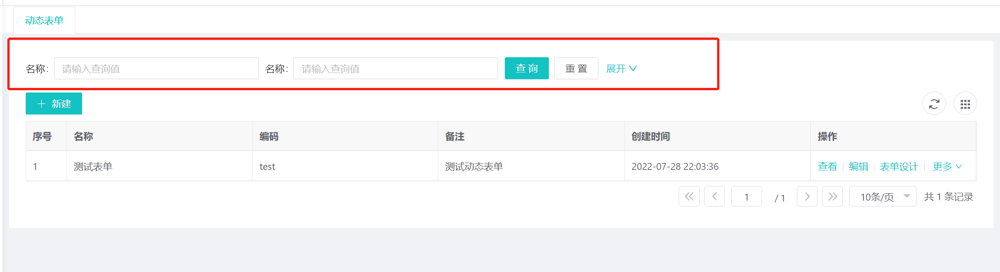

## 超级查询器
::: tip
包括超级查询器和普通查询器，分别可以用在复杂查询的场景，和通用的查询地方。
:::

### 超级查询器
### 效果


### 使用方式
在要进行查询的页面引入超级查询器组件，并放在合适的位置上
导入语句：`import BSuperQuery from '@/components/Bootx/SuperQuery/BSuperQuery'`

```vue
<b-super-query
  :queryState="superQueryFlag"
  :fields="queryFields"
  :width="880"
  button-title="超级查询"
  model-title="超级查询器"
  @query="superQuery"
  @reset="resetQuery"
/>
```
```typescript
const queryFields = [
  { field: 'name', name: '姓名', type: STRING },
  { field: 'age', name: '年龄', type: NUMBER },
  { field: 'vip', name: '是否vip', type: BOOLEAN },
  { field: 'birthday', name: '生日', type: DATE },
  { field: 'workTime', name: '上班时间', type: TIME },
  { field: 'registrationTime', name: '注册时间', type: DATE_TIME },
  { field: 'political',
    name: '政治面貌',
    type: LIST,
    selectList:
      [
        { label: '党员', value: '0' },
        { label: '群众', value: '1' },
        { label: '团员', value: '2' }
      ]
  }
] as QueryField[]
```

### 组件参数
> 主要用于超级查询器组件的参数配置

| 参数          | 类型           | 功能         | 是否必填 | 默认值                 |
|-------------|--------------|------------|------|---------------------|
| queryState  | boolean      | 查询状态       | 是    | false               |
| fields      | QueryField[] | 查询字段配置     | 是    | 无                   |
| buttonTitle | string       | 按钮标题       | 否    | 超级查询                |
| buttonIcon  | string       | 按钮图标       | 否    | ant-design:appstore |
| modelTitle  | string       | 弹框标题       | 否    | 超级查询器               |
| width       | number       | 宽度         | 否    | 840                 | 
| @query      | Function     | 点击查询时的回调   | 否    |                     | 
| @rest       | Function     | 点击取消查询时的回调 | 否    |                     | 

### QueryField参数说明
> 主要用于组件中`fields`参数的配置说明

| 字段          | 类型             | 说明                                                                                            |
|-------------|----------------|-----------------------------------------------------------------------------------------------|
| field       | string         | 查询字段名                                                                                         |
| name        | string         | 显示名称                                                                                          |
| type        | 见下文 Type数据类型   | 数据类型                                                                                          |
| md          | number         | 栅格宽度                                                                                          |
| valueFormat | string         | 时间格式化, `type`数据类型为日期时间类型时可用，绑定值的格式，默认为 `yyyy-MM-DD HH:mm:ss` / `yyyy-MM-DD` / `HH:mm:ss`类型的样式 |
| precision   | number         | 小数点位数，默认为0位,`type`数据类型为`number`时可用                                                            |
| selectList  | LabeledValue[] | 查询列表内容, `type`数据类型为`list`的时候，通过这个字段传入列表的内容                                                    |

### QueryParam参数说明
> 主要用于查询回调函数中回传的参数的说明

| 字段           | 类型           | 说明                                          |
|--------------|--------------|---------------------------------------------|
| or           | string       | 'true'或'false',antd select 组件限制原因导致不能使用bool |
| paramName    | string       | 参数名称                                        |
| format       | string       | 格式化 主要用于时间格式化                               |
| precision    | number       | 小数精度                                        |
| compareType  | string       | 比较类型，见下方 `CompareType数据比较类型`                |
| paramType    | string       | 参数类型                                        |
| paramValue   | string       | 参数值                                         |
| nestedParams | QueryParam[] | 嵌套查询                                        |


### Type数据类型
可以引入`import BSuperQuery from '@/components/Bootx/SuperQuery/superQueryCode'`中的类型常量值进行配置，所支持的类型如下
```javascript
// 数字
export const NUMBER = 'number'
// 字符串
export const STRING = 'string'
// 布尔
export const BOOLEAN = 'boolean'
// 日期
export const DATE = 'date'
// 时间
export const TIME = 'time'
// 日期时间
export const DATE_TIME = 'date_time'
// 列表
export const LIST = 'list'
```
### CompareType数据比较类型
> 回调时回传参数中的compareType的类型

| 类型         | 说明    |
|------------|-------|
| eq         | 等于    |
| ne         | 不等于   |
| like       | 模糊匹配  |
| like_left  | 左模糊   |
| like_right | 右模糊   |
| not_like   | 模糊不等于 |
| gt         | 大于    |
| ge         | 大于等于  |
| lt         | 小于    |
| le         | 小于等于  |
| is_null    | 是否为空  |
| not_null   | 是否不为空 |


### 回调方法
**@query查询回调**
```typescript
// 回传传查询参数, queryParams 对应的是后端QueryParams对象
function query(queryParams) {}
```
**@reset取消回调**
回调函数没有参数，是个空参方法，用于重置查询参数

## 普通查询器


### 使用说明
导入语句：`import BQuery from '@/components/Bootx/SuperQuery/BQuery'`
```vue
<b-query
  v-model="queryParam"
  :fields="fields"
  :gutter="10"
  :disabled-query="true"
  :default-item-count="2"
  :default-item-md="6"
  @query="query"
  @reset="() => queryParam = {}"
/>
```
```typescript
    // 查询条件
    const fields = [{ field: 'name', type: STRING, name: '名称', placeholder: '请输入流程模型名称' }] as QueryField[]
```

### 组件参数
> 主要用于超级查询器组件的参数配置

| 参数          | 类型           | 功能         | 是否必填 | 默认值                 |
|-------------|--------------|------------|------|---------------------|
| fields      | QueryField[] | 查询字段配置     | 是    | 无                   |
| queryParams  | boolean      | 查询状态       | 是    | false               |
| defaultItemCount | string       | 按钮标题       | 否    | 超级查询                |
| defaultItemMd  | string       | 按钮图标       | 否    | ant-design:appstore |
| disabledQuery  | string       | 弹框标题       | 否    | 超级查询器               |
| gutter       | number       | 宽度         | 否    | 840                 | 
| @query      | Function     | 点击查询时的回调   | 否    |                     | 
| @rest       | Function     | 点击取消查询时的回调 | 否    |                     | 

组件对应的各项参数：

- `v-model` 查询参数对象
- `fields`查询字段配置列表，通过传入的数据构建成查询器，根据其中的设置将值赋到查询参数对象上
- `gutter` 查询条目之间间隔数
- `default-item-md` 每个查询项所占的栅格数，可以通过这个参数来设置，默认为6，会被字段配置中的参数覆盖
- `default-item-count` 默认展示出几个查询项，超过的将会被隐藏，需要点击展开来进行使用，默认展示2个
- `default-item-count` 是否禁用查询，禁用查询后，查询按钮变为不可用，通常配合超级查询器进行使用
- `@query`：点击查询时的回调
- `@rest`：点击取消查询时的回调


`**fields**`**查询配置参数**
```javascript
[
  { field: 'num', name: '数字', type: NUMBER, precision: 2 },
  { field: 'string', name: '字符', type: STRING, placeholder: '请输入表单名称' },
  { field: 'bool', name: '布尔', type: BOOLEAN, md: 12 },
  { field: 'date', name: '日期', type: DATE },
  { field: 'time', name: '时间', type: TIME },
  { field: 'date_time', name: '日期时间', type: DATE_TIME },
  { field: 'list',
   name: '列表',
   type: LIST,
   list:
   [
     { lable: '测试1', value: 'cs1' },
     { lable: '测试2', value: 'cs2' },
     { lable: '测试3', value: 'cs3' }
   ] }
]
```
参数说明：

- `field`：查询字段名
- `name`：显示名称，查询器查询页面显示的查询字段名称
- `type`：数据类型，根据传入不同的的数据类型，会使用不同的组件
- `placeholder`：提示文本
- `md`：查询项对应占用的栅格数，会覆盖默认配置的`item-md`配置
- `precision` : type数据类型为number时可用，表示小数点位数，默认为0位
- `list`：type数据类型为list的时候，通过这个字段传入
   - `lable`：显示名称
   - `value`：查询的值，等同`field`

**数据类型（type）**
与超级查询器一致

**@query查询回调**
回调函数没有参数，是个空参方法，用于发起查询

**@reset取消回调**
回调函数没有参数，是个空参方法，用于重置查询参数
