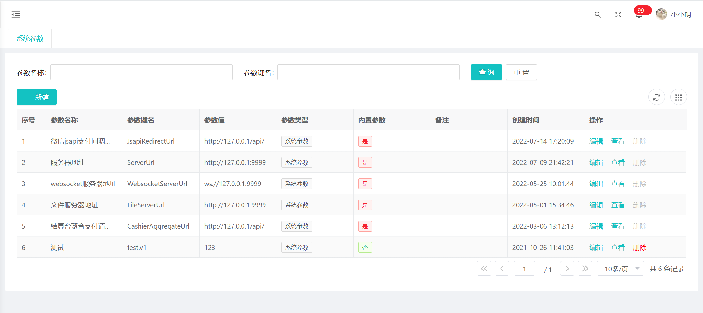

# 基础服务
::: tip
功能主要包括一些系统运行时基础的数据、配置，通常是与业务相关性不大的功能
:::
## 功能介绍
- 字典管理
- 行政区划管理
- 验证码管理
- 参数配置
- 动态表单管理
- 动态数据源管理
- 键值对存储
## 字典管理
分为字典和字典项两级，通过字典编码和字典项编码可以确定唯一的一项字典值，字典编码互相不可以重复，同一个字典项的字典项编码互相也不可用重复，
不同字典下的字典项编码可以重复。通常是在前端使用，前端使用见[字典组件(vue2)](/doc/front/vue2/字典组件使用.md)、
[字典组件(vue2)](/doc/front/vue3/字典组件.md) 说明，后端使用[数据翻译组件](/doc/server/common/数据翻译.md)
## 验证码生成
生成算数或者文本验证码，使用`easy-captcha`类库 [GIT地址](https://gitee.com/ele-admin/EasyCaptcha) ，对应项目代码地址在`cn.bootx.baseapi.core.captcha.service.CaptchaService`。
## keyValue键值对对象
主要用在存储一些程序运行时配置，如定时任务同步数据， 上次同步到的时间点等场景，在使用时只需导入`cn.bootx.common.core.function.SystemKeyValueService`
## 参数配置

> 用在一些需要动态化配置的地方，相当于一个袖珍版的配置中心，常见场景如配置图片服务地址、聚合支付地址、微信认证回调服务地址等。
在需要获取参数的地方，导入`cn.bootx.common.core.function.ParamService`，通过`getValue(String key)`获取对象，
配置也页面如下，菜单地址 系统管理 -> 系统配置 -> 系统参数
## 动态表单
目前只有vue2版本
## 行政区划

## 动态数据源