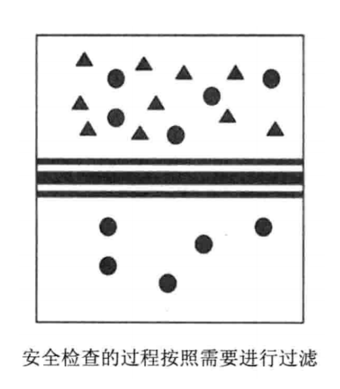

# 什么是安全 ?
## 概述
在我们解决问题前，⾸先需要明⽩我们的问题是什么，在明⽩了问题是什么，我们才能从问题的产⽣逻辑和问题的运转逻辑中找到问题出现的点和解决的办法。
正如《道德经》第⼗六章所说：

> 致虚极，守静笃，万物并作，吾以观复。夫物芸芸，各归其根。归根⽈静，静⽈复命。复命⽈常，知常⽈明，不知常，妄作凶。
> 知常容，容乃公，公乃全，全乃天，天乃道，道乃久，没身不殆。

需要“知常"，“不知常"最后只能导致“妄作凶"，“知常"后才能“容"，才能“公"，才能“全"，最终才能“没身不殆"。也就是说，我们了解事物，了解问题，需要知道其运转本质，知道其根本逻辑之后，才能对该问题提出
解决方法，提出自己的⻅解，否则随意发表自己的⻅解和凭感觉处理问题只会“妄作凶"。⽽在了解本质后才能提出周“全"、包“容"、符合道(⾃然规律)的解决方案和办法，才能永久不衰，“没身不殆"。

安全是⼀个普世存在的问题，我们可以从现实世界⼊手，来看下面⼀个场景：

> ⽕⻋站、机场里，在乘客们开始正式旅程之前，都有⼀个必要的程序：安全检查。机场的安全检查，会扫描乘客的⾏李箱，检查乘客身上是否携带打⽕机、可燃液体等危险物品。

抽象地说，这种安全检查，就是过滤掉有害的、危险的东⻄。因为在⻜⾏的过程中，⻜机远离地⾯，如果发⽣危险，将会直接危害到乘客们的⽣命安全。
因此，⻜机是⼀个⾼度敏感和重要的区域，任何有危 害的物品都不应该进⼊这⼀区域。为达到这⼀⽬标，登机前到安全检查就是⼀个⾮常有必要的步骤。

从安全的⻆度来看，我们将不同重要程度的区域划分出来：

通过⼀个安全检查(过滤、净化)的过程，可以梳理未知的⼈或物，使其变得可信任。被划分出来的具有
不同信任级别的区域，我们称为信任域，划分两个不同信任域的边界，我们称为信任边界。

数据从⾼等级的信任域流向低等级的信任域，是不需要进过安全检查的；数据从低等级的信任域流向⾼
等级的信任域，则需要经过信任边界的安全检查。

所以，**安全问题的本质是信任的问题**。

⼀切安全⽅案设计的基础，都是建⽴在信息关系上的。我们必须相信⼀些东⻄，必须有⼀些最基本的假
设，安全⽅案才能得以建⽴；如果我们否定⼀切，安全⽅案就会如⽆源之⽔，⽆根之⽊，⽆法设计，也
⽕⻋站、机场里，在乘客们开始正式旅程之前，都有⼀个必要的程序：安全检查。机场的安全检查，
会扫描乘客的⾏李箱，检查乘客身上是否携带打⽕机、可燃液体等危险物品。⽆法完成。

## 安全三要素
要全⾯地认识⼀个安全问题，我们有很多种办法，但⾸先要理解安全问题的组成属性。前⼈通过⽆数实践，最后将安全的属性总结为安全三要素，简称CIA

安全三要素是安全的基本组成元素，分别是**机密性(Confidentiality)**、**完整性(Integrity)**、**可用性(Availability)**。

**机密性**要求保护数据内容不能泄露，加密是实现机密性要求的常⻅⼿段。

**完整性**则要求保护数据内容是完整、没有被篡改的。常⻅的保证⼀致性的技术⼿段是数字签名。

**可用性**要求保护资源是“随需⽽得"，比如拒绝服务攻击(DOS)攻击破坏的就是安全的可用性。

