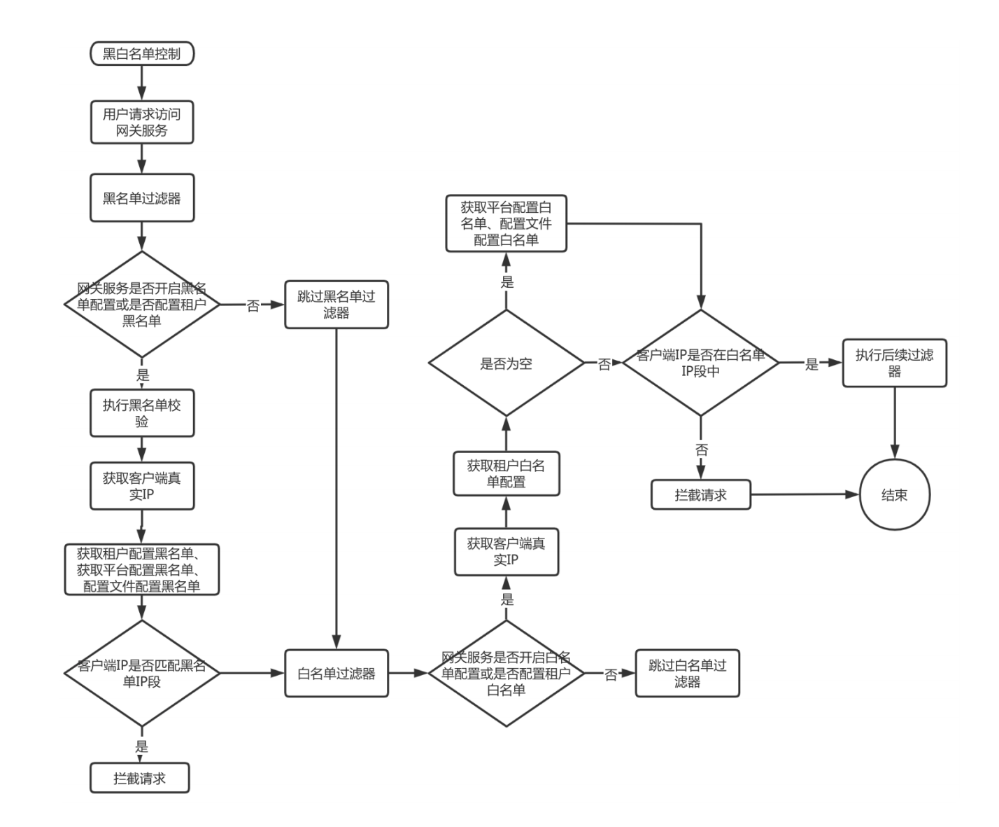
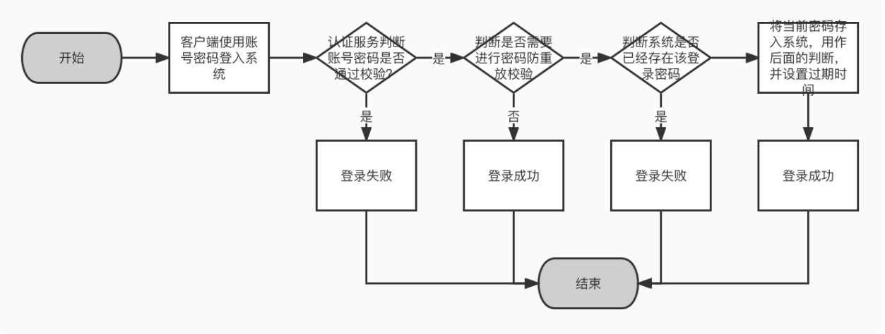

# 安全体系设计
## 安全策略
### 密码安全策略
密码安全策略主要解决系统登录密码相关的问题，项⽬可以使⽤密码安全策略的功能，灵活快速的配置，通过以上的各种配置，可以解决⼤部分对密码要求的场景，
项⽬可以基于实际情况进⾏配置处理。系统对密码的基本要求，主要包含以下⼏个⽅⾯：
- 默认密码的处理策略：是使⽤随机密码还是使⽤固定的密码；
- 密码更新策略：密码的更新频率与密码到期提示；
- 密码格式策略：密码的⻓度、密码的字符使⽤限制等配置，可根据系统所需⾃⾏定义；
- 密码操作策略：是否能使⽤近期使⽤过的密码、是否能与登录名相同、更改密码是是否需要验证码 验证等策略。

::: tip
⽬前没有⼀个标准的密码策略，但是根据[OWASP](http://www.owasp.org/)推荐的⼀些最佳实践，我们可以对密码策略稍作总结。

密码⻓度⽅⾯：
- 普通应⽤要求⻓度为6位以上；
- 重要应⽤要求⻓度为8位以上。

密码复杂度⽅⾯：
- 密码区分⼤⼩写字⺟；
- 密码为⼤写字⺟、⼩写字⺟、数字、特殊符号中两种以上的组合；
- 不要有连续性的字符，⽐如1234abcd，这种字符顺着⼈的思路，所以很容易猜解；
- 尽量避免出现重复字符，⽐如1111。
:::

除了OWASP推荐的策略外，还需要注意，不要使⽤⽤户的公开数据，或者是与个⼈隐私相关的数据作为密码。⽐如不要使⽤QQ号、身份证号码、昵称、电话号码、⽣⽇、英⽂名、公司名等作为密码，
这些资料往往可以从互联⽹上获得，并不是那么保密。

### 登录安全策略
登录安全策略主要解决⽤户登录相关的问题，可以决定系统在⽤户登录时的各个场景下所做出的反应，
可以更灵活的保障系统与⽤户交互时的安全，主要包含以下⼏个⽅⾯: 

- 登录次数限制与措施：系统会限制⽤户登录错误次数，并在登录密码错误时加⼊验证码限制，在登
  录错误次数达到最⼤限制时进⾏账号锁定；
- 多因素校验：系统在⽤户登录后，可通过⼿机号/邮箱进⼀步对⽤户进⾏验证，使⽤多因素对⽅式来
  保障系统安全；
- 访问令牌限制：系统在⽤户登录成功后会发放⼀个访问令牌，在这⾥可以对访问令牌的有效时间进
  ⾏限制，保障不存在永久性的令牌；
- 其他：强制修改处理密码可以保证⽤户进⼊系统后改变初始密码，防⽌在固定密码的情况下被别有
  ⽤⼼的操作者使⽤默认密码试探访问系统；还有多端登录控制、修改密码后重新登录等控制，保证
  系统登录的安全性。

登录安全策略可对系统登录相关的功能进⾏控制与指导，例如，控制⽤户登录时密码最⼤的错误次数，
当超过该次数时，则会将⽤户账号进⾏冻结，防⽌⾮法⽤户暴⼒破解系统⽤户密码; ⼜例如，控制⽤户账户只能在单处登录，当在多处登录时，提示账号登录异常：

### 黑白名单
可以配置租户级的⿊⽩名单，限制访问系统的能⼒。⿊⽩名单使⽤流程图：

### 密码防重放
在密码加密传输的场景下，防⽌相同的加密密码重复认证。

### 密码加密传输

### 账号加密传输

### 在线⽤户

### ⽤户登录⽇志

### 用户操作日志