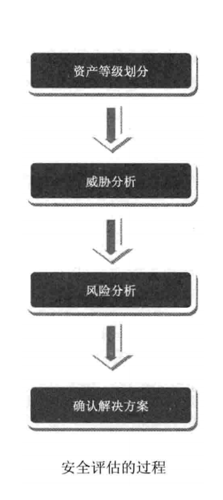

# 安全评估
## 简述
有了前⾯的基础，我们就可以正式开始分析并解决安全问题了。⼀个安全评估的过程，可以简单分为4个阶段：资产等级划分、威胁分析、⻛险分析、确认解决⽅案。

一般来说，按照这个过程来实施安全评估，在结果上不会出现较⼤的问题。这个实施的过程是层层递进的，前后之间有因果关系。

## 资产等级划分
资产等级划分是所有⼯作的基础，这项⼯作能够帮助我们明确⽬标是什么，要保护什么。

在互联⽹的基础设施已经⽐较完善的今天，互联⽹的核⼼其实是由⽤户数据驱动的——⽤户产⽣业务，
业务产⽣数据。所以——互联⽹安全的核⼼问题，是数据安全的问题。项⽬应该基于对业务不同数据重
要性的理解，划分不同的信⽤域和信⽤边界。

与普通项⽬不同，H0是⼀个技术框架，更多时候是从项⽬结构上去分析从⽽得到需要进⾏安全处理的节
点，并提供这些节点所需的安全⼯具或安全解决⽅案。

### 客户端
Bootx是⼀个web应⽤脚手架，在这里的客户端我们⼀般是指浏览器这个与⽤户交互的⼯具，所以浏览器
所⾯临的安全问题也是我们系统所要⾯临的安全问题，虽然⼤部分的问题由浏览器的默认设置解决，但
部分构建浏览器安全基础技术所引发的安全问题，需要我们注意与避免，⽐如XSS、跨域等问题。

### 认证服务
认证服务主要⽤于识别当前操作者是谁，正确识别当前操作者是保证系统安全的前提条件，确对⽤户与⽤户权限的识别是保证系统安全的基础

### 授权服务
授权服务主要是⽤于标识认证实体所拥有的权限。

### 其他服务
其他服务⽀持系统的运转，是系统存在的意义，对于这些服务中的相关安全问题，需要提供统⼀的⼯具
和⽅案。

### 数据库
数据库是系统最为重要的基础，保证数据库中的数据安全需要格外注意。

## 威胁分析
信任域划分好之后，我们如何才能确定危险来⾃哪里呢？在安全领域里，我们**把可能造成危害的来源称为威胁(Threat)，⽽把可能会出现的损失称为⻛险(Risk)**。
⻛险⼀定是和损失联系在⼀起的。

那什么是威胁分析呢？威胁分析就是把所有的威胁都找出来。那怎么找呢？⼀般是采⽤头脑⻛暴法。当 然，也有⼀些⽐较科学的⽅法，
⽐如使⽤⼀个模型，帮助我们去想，在哪些⽅⾯有可能会存在威胁，这 个过程能够避免遗漏，这就是威胁建模。

### STRIDE模型
下⾯，我们使⽤⼀种威胁建模的⽅法，它最早是由微软提出的，叫做STRIDE模型，STRIDE是6个单词的⾸字⺟缩写，我们在分析威胁时，可以从以下6个⽅⾯去考虑。

| 威胁                           | 定义       | 对应的安全属性 |
|------------------------------|----------|---------|
| Spoofing(伪装)                 | 冒充他人身份   | 认证      |
| Tampering(篡改)                | 修改数据或代码  | 完整性     |
| Repudiation(抵赖)              | 否认做过的事情  | 不可抵赖性   |
| InformationDisclosure(信息泄露)  | 机密信息泄露   | 机密性     |
| Denial of Service(拒绝服务)      | 拒绝服务     | 可用性     |
| Elevation of Privilege(提升权限) | 未经授权获得许可 | 授权      |

### 威胁模型
在进⾏威胁分析时，要尽可能地不遗漏威胁，头脑⻛暴的过程可以确定攻击⾯(Attack Surface)。
我们使⽤该模型分析得到的威胁模型如下：

| 威胁编码    | 威胁描述                               | 威胁编码 | 威胁类型 |
|---------|------------------------------------|------|------|
| SPO-001 | 系统⽤户设置的密码过于简单                      | SPO  | 伪装   |
| SPO-003 | 恶意⽤户穷举试探系统⽤户密码                     | SPO  | 伪装   |
| SPO-004 | 恶意⽤户窃取系统⽤户密码登⼊系统                   | SPO  | 伪装   |
| SPO-005 | 恶意⽤户⼿机验证码登录试探系统⼿机号信息               | SPO  | 伪装   |
| SPO-006 | 恶意⽤户穷举试探系统⽤户信息                     | SPO  | 伪装   |
| SPO-007 | 恶意⽤户抓包解析系统⽤户密码                     | SPO  | 伪装   |
| SPO-008 | 恶意⽤户窃取系统⽤户token访问系统                | SPO  | 伪装   |
| SPO-009 | 恶意⽤户伪造登录界⾯让系统⽤户登录后跳转到恶意地址截取token信息 | SPO  | 伪装   |
| TAM-001 | 恶意⽤户CSRF攻击                         | SPO  | 伪装   |
| TAM-002 | 恶意⽤户篡改系统数据                         | TAM  | 篡改   |
| TAM-003 | 恶意⽤户对系统进⾏SQL注⼊攻击                   | TAM  | 篡改   |
| TAM-004 | 恶意⽤户XXS攻击                          | TAM  | 篡改   |
| REP-001 | 恶意⽤户对系统做了未知的操作                     | TAM  | 篡改   |
| IDS-001 | 恶意⽤户窃取界⾯敏感信息                       | IDS  | 信息泄露 |
| IDS-002 | 恶意⽤户窃取界⾯关键信息                       | IDS  | 信息泄露 |
| IDS-003 | 恶意⽤户操作数据库获取系统关键信息                  | IDS  | 信息泄露 |
| IDS-004 | 恶意⽤户跨域访问                           | IDS  | 信息泄露 |
| DOS-001 | 恶意⽤户故意发起⼤量请求破坏系统可⽤性                | DOS  | 拒绝服务 |
| EOP-002 | 恶意⽤户垂直越权                           | EOP  | 提升权限 |
| EOP-003 | 恶意⽤户⽔平越权                           | EOP  | 提升权限 |
| EOP-004 | 恶意⽤户上传有害⽂件                         | EOP  | 提升权限 |
| OTH-001 | 系统使⽤的三⽅组件漏洞                        | OTH  | 其他   |

## ⻛险分析

> ⻛险由以下因素组成：Risk = Probability * Damage Potential

影响⻛险⾼低的因素，出了造成损失的⼤⼩外，还需要考虑到发⽣的可能性，我们在考虑安全问题时，
要结合具体情况，权衡事件发⽣的可能性，才能正确地判断出⻛险。

如何更科学地衡量⻛险呢？我们使⽤DREAD模型来科学的衡量⻛险，该模型也是微软提出的。DREAD
也是⼏个单词的⾸字⺟缩写，它指导我们应该从哪些⽅⾯去判断⼀个威胁的⻛险程度。

| 等级                    | 高(3)                    | 中(2)                  | 低(1)        |
|-----------------------|-------------------------|-----------------------|-------------|
| DamagePotential(危害程度) | 获取完全验证权限:执行管理员操作;非法上传文件 | 泄露敏感信息                | 泄露其他信息      |
| Reproducibility(可复现性) | 攻击者可以随意再次攻击             | 攻击者可以重复攻击，但有时间限制      | 攻击者很难重复攻击过程 |
| Exploitability(利用难度)  | 初学者在短期内能掌握攻击方法          | 熟练的攻击者才能完成这次攻击        | 漏洞利用条件非常苛刻  |
| Affected users(影响面)   | 所有用户，默认配置，关键用户          | 部分用户，非默认配置            | 极少数用户，匿名用户  |
| Discoverability(发现难度) | 漏洞很显眼，攻击条件很容易获得         | 在私有区域，部分人能看到，需要深入挖掘漏洞 | 发现该漏洞极其困难   |

在DREAD模型中，每⼀个因素都可以分为⾼、中、低三个等级。在上表中，⾼、中、低三个等级分别以
3、2、1的分数代表其权重值，因此，我们可以具体计算出某⼀个威胁的⻛险值。

对于我们系统:

| 威胁编码    | 威胁描述                               | D-危害程度 | R-可复现性 | E-利用难度 | A-影响面 | D-发现难度 | 风险分值 |
|---------|------------------------------------|--------|--------|--------|-------|--------|------|
| SPO-001 | 系统⽤户设置的密码过于简单                      | 2      | 2      | 3      | 3     | 3      | 13   |
| SPO-003 | 恶意⽤户穷举试探系统⽤户密码                     | 2      | 2      | 3      | 3     | 3      | 13   |
| SPO-004 | 恶意⽤户窃取系统⽤户密码登⼊系统                   | 2      | 1      | 2      | 3     | 2      | 10   |
| SPO-005 | 恶意⽤户⼿机验证码登录试探系统⼿机号信息               | 2      | 2      | 3      | 3     | 3      | 13   |
| SPO-006 | 恶意⽤户穷举试探系统⽤户信息                     | 1      | 2      | 3      | 3     | 3      | 12   |
| SPO-007 | 恶意⽤户抓包解析系统⽤户密码                     | 2      | 2      | 2      | 3     | 2      | 11   |
| SPO-008 | 恶意⽤户窃取系统⽤户token访问系统                | 2      | 1      | 2      | 1     | 2      | 8    |
| SPO-009 | 恶意⽤户伪造登录界⾯让系统⽤户登录后跳转到恶意地址截取token信息 | 2      | 3      | 2      | 1     | 2      | 10   |
| TAM-001 | 恶意⽤户CSRF攻击                         | 3      | 3      | 1      | 3     | 1      | 11   |
| TAM-002 | 恶意⽤户篡改系统数据                         | 1      | 3      | 3      | 3     | 3      | 13   |
| TAM-003 | 恶意⽤户对系统进⾏SQL注⼊攻击                   | 3      | 3      | 2      | 3     | 2      | 13   |
| TAM-004 | 恶意⽤户XXS攻击                          | 3      | 3      | 1      | 3     | 1      | 11   |
| REP-001 | 恶意⽤户对系统做了未知的操作                     | 2      | 2      | 3      | 3     | 2      | 12   |
| IDS-001 | 恶意⽤户窃取界⾯敏感信息                       | 2      | 2      | 3      | 3     | 3      | 13   |
| IDS-002 | 恶意⽤户窃取界⾯关键信息                       | 2      | 2      | 3      | 3     | 3      | 13   |
| IDS-003 | 恶意⽤户操作数据库获取系统关键信息                  | 2      | 1      | 1      | 3     | 1      | 8    |
| IDS-004 | 恶意⽤户跨域访问                           | 3      | 3      | 1      | 3     | 1      | 11   |
| DOS-001 | 恶意⽤户故意发起⼤量请求破坏系统可⽤性                | 1      | 1      | 2      | 3     | 2      | 9    |
| EOP-002 | 恶意⽤户垂直越权                           | 3      | 3      | 2      | 3     | 1      | 12   |
| EOP-003 | 恶意⽤户⽔平越权                           | 3      | 3      | 2      | 3     | 2      | 13   |
| EOP-004 | 恶意⽤户上传有害⽂件                         | 3      | 1      | 1      | 3     | 1      | 9    |
| OTH-001 | 系统使⽤的三⽅组件漏洞                        | x      | x      | x      | x     | x      | x    |

通过对威胁的⻛险分析，我们可以得到⼀个威胁分值表，我们可以通过对威胁最终的分值，来决定需要 对哪些威胁场景进⾏处理。我们做出以下的规定：
> ⾼危：12～15分
> 
> 中危：8～11分
> 
> 低危：0～7分

在⼀般情况下，我们需要处理掉所有⾼危和中危的威胁，处理部分低危的威胁。以上的威胁和⻛险分析是在H0本身的⻆度，可能与实际的项⽬会有⼀定的偏差，
再考虑到H0是⼀个技术平台，所以我们尽可能的提供了所有已分析到的威胁的处理⽅案，后期如有新的威胁加⼊威胁清单中，可基于现有的结构 和逻辑进⾏功能的迭代与完善。

## 设计安全⽅案

安全评估的产出物，就是安全解决⽅案。解决⽅案⼀定要有针对性，这种针对性是由资产等级划分、威胁分析、⻛险分析等阶段的结果给出的。

⼀个优秀的安全⽅案应该具备以下特点：
- 能够有效解决问题
- ⽤户体验好
- ⾼性能
- 低耦合
- 易于扩展与升级

对于以上分析出来的威胁和⻛险，做了对应的处理办法:

| 威胁编码    | 威胁描述                               | 处理方案                           |
|---------|------------------------------------|--------------------------------|
| SPO-001 | 系统⽤户设置的密码过于简单                      | 密码安全策略                         |
| SPO-003 | 恶意⽤户穷举试探系统⽤户密码                     | 登录安全策略                         |
| SPO-004 | 恶意⽤户窃取系统⽤户密码登⼊系统                   | 多因素认证(⼆次校验)                    |
| SPO-005 | 恶意⽤户⼿机验证码登录试探系统⼿机号信息               | 增加图像验证码                        |
| SPO-006 | 恶意⽤户穷举试探系统⽤户信息                     | 所有⽤户登录时系统表现⼀致                  |
| SPO-007 | 恶意⽤户抓包解析系统⽤户密码                     | 登录/注册/修改密码时密码加密传输              |
| SPO-008 | 恶意⽤户窃取系统⽤户token访问系统                | token失效时间、令牌管理、在线⽤户、登录⽇志       |
| SPO-009 | 恶意⽤户伪造登录界⾯让系统⽤户登录后跳转到恶意地址截取token信息 | 客户端配置重定向后允许重定向的地址              |
| TAM-001 | 恶意⽤户CSRF攻击                         | API防重放、access_token            |
| TAM-002 | 恶意⽤户篡改系统数据                         | 数据防篡改                          |
| TAM-003 | 恶意⽤户对系统进⾏SQL注⼊攻击                   | 预编译SQL语句与参数填充                  |
| TAM-004 | 恶意⽤户XXS攻击                          | 设置httpOnly解决cookie劫持问题、输⼊/输出检测 |
| REP-001 | 恶意⽤户对系统做了未知的操作                     | 数据审计、单据审计                      |
| IDS-001 | 恶意⽤户窃取界⾯敏感信息                       | 敏感字段脱敏、敏感字段隐藏                  |
| IDS-002 | 恶意⽤户窃取界⾯关键信息                       | 关键信息不展示，⽐如密码信息等                |
| IDS-003 | 恶意⽤户操作数据库获取系统关键信息                  | 密码加密存储、关键数据加密存储                |
| IDS-004 | 恶意⽤户跨域访问                           | 配置跨域策略                         |
| DOS-001 | 恶意⽤户故意发起⼤量请求破坏系统可⽤性                | ⿊⽩名单、限流、API访问控制、API统计          |
| EOP-002 | 恶意⽤户垂直越权                           | 访问权限控制                         |
| EOP-003 | 恶意⽤户⽔平越权                           | 主键加密、雪花主键、数据权限控制、字段权限控制        |
| EOP-004 | 恶意⽤户上传有害⽂件                         | ⽂件上传配置, 文件隔离                   |
| OTH-001 | 系统使⽤的三⽅组件漏洞                        | 关注业界发布的漏洞信息，及时修复与更新            |

