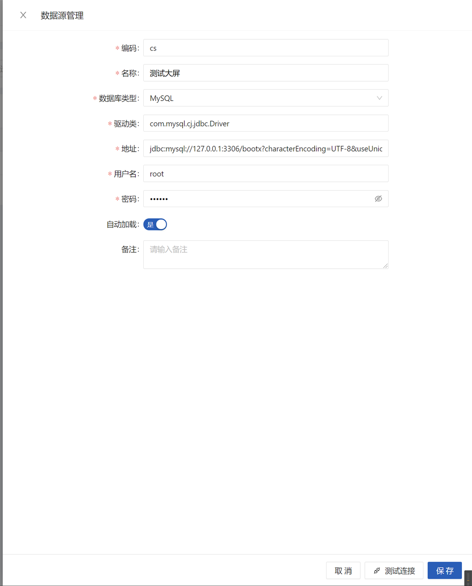
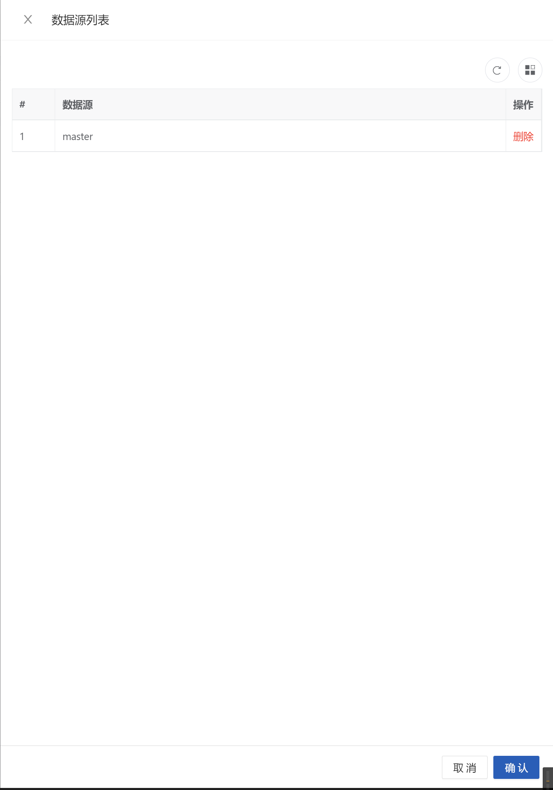

# 动态数据源
::: tip
基于 [dynamic-datasource](https://gitee.com/baomidou/dynamic-datasource-spring-boot-starter)实现多数据源管理，所拥有的特性取决于`dynamic-datasource`的支持下。
它对应的付费文档地址为：[云文档](https://www.kancloud.cn/tracy5546/dynamic-datasource/2264611)。

动态数据源推荐用于一些数据库连接地址容易出现变动的场合，例如与第三方系统进行表同步，临时对数据进行取数等操作，如果是长期不变的，尤其是系统锁依赖的业务库，推荐在配置文件中进行配置，
:::

## 截图
**新增或更新**
> 数据源编码是唯一的，并且编码必须以字母开头，可包含数字、下划线、横杠。



**数据源列表**
> 用来查看当前系统已经加载的数据源列表，可以进行动态的删除，注意主数据源无法被删除。


## 数据源管理

| 属性或操作 | 备注                             |
|-------|--------------------------------|
| 编码    | 该动态数据源的唯一标识，不可以重复              |
| 名称    |                                |
| 数据库类型 |                                |
| 自动加载  |                                |
| 驱动类   | 若回显的驱动类和数据源地址与你的数据库版本不一致，可自行修改 |
| 数据库地址 |                                |
| 用户名   |                                |
| 测试连接  | 对填写的数据库连接信息进行测试                |

## 使用说明
> 基于`dynamic-datasource`简单叙述一下，多数据源在系统中如何进行使用

**配置文件配置多数据源**
> master 为主数据源，系统默认数据源
```yaml
datasource:
   datasource: 
          master: 
            url: jdbc:mysql://127.0.0.1:3306/bootx-platform?characterEncoding=UTF-8&useUnicode=true&useSSL=false
            username: root
            password: root
            driver-class-name: com.mysql.jdbc.Driver   
          multi-datasource1: 
            url: jdbc:mysql://localhost:3306/bootx-flowable?useUnicode=true&characterEncoding=utf8&autoReconnect=true&zeroDateTimeBehavior=convertToNull&transformedBitIsBoolean=true
            username: root
            password: root
            driver-class-name: com.mysql.jdbc.Driver
```
**动态数据源切换**

- 使用`@DS`注解切换数据源，将该注解添加到方法或者类上，自动就可以进行切换。
- 手动切换数据源，通过调用`DynamicDataSourceContextHolder`下的方法进行手动的切换数据源。
- 使用`filter`过滤器或`intercepror`拦截器进行切换，底层基于`DynamicDataSourceContextHolder.push`进行切换
- 使用AOP切面进行切换，底层基于`DynamicDataSourceContextHolder.push`进行切换

## 注意事项
多数据源会涉及到分布式事务问题，同时与`@Transational`一起使用就有可能出现切换数据源失败问题，需要进行特别注意，详情可以阅读`dynamic-datasource`的付费文档。
