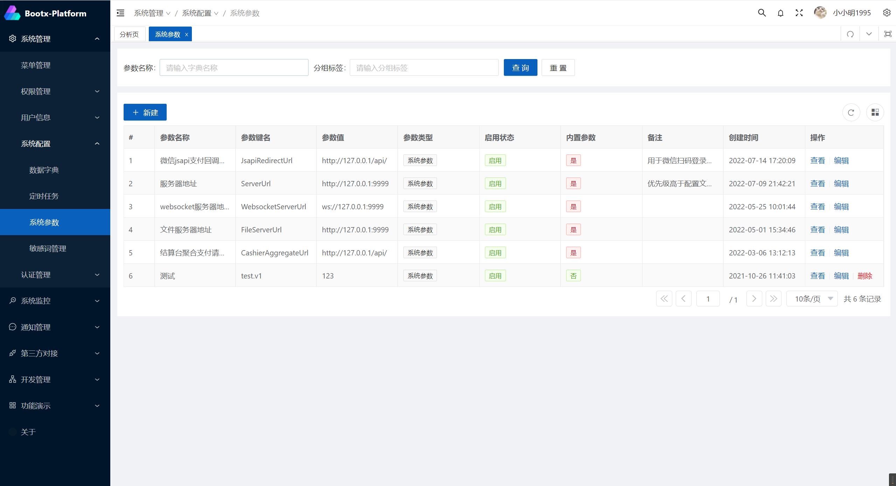

# 参数配置
主要用在存储一些程序运行时配置，相当于一个袖珍版的配置中心，包括系统参数和用户参数，例如文件服务器地址、WebSocket连接地址等。
其中有些参数为系统内置参数，无法进行删除，只能对部署属性进行修改。

## 功能截图


## 使用说明(后端)
在系统中需要进行使用参数配置时，可以引入`cn.bootx.platform.common.core.function.ParamService`接口服务类，
用其中的`getValue`方法获取参数配置，如果参数未启用, 返回`null`。

```java
@Service
@RequiredArgsConstructor
public class FileUploadService {
    private final ParamService paramService;
   
    /**
     * 服务地址
     */
    private String getServerUrl() {
        String serverUrl = paramService.getValue("FileServerUrl");
        if (StrUtil.isBlank(serverUrl)) {
            serverUrl = fileUploadProperties.getServerUrl();
        }
        return serverUrl;
    }

}
```
## 使用说明(前端)
> 通过导入对应的请求接口，就可以快速获取到锁对应的配置。

```typescript
import { findByParamKey } from '/@/api/common/Parameter'
// 获取商户和应用编码
mchCode = (await findByParamKey('CashierMchCode')).data
```