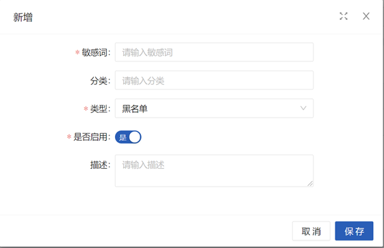
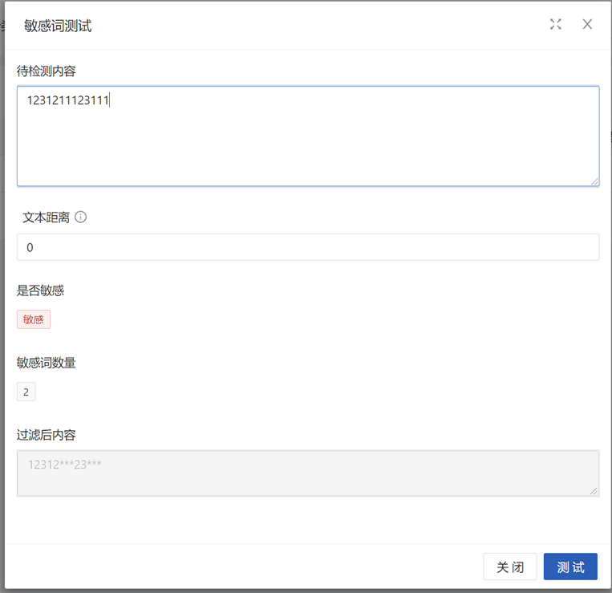

# 敏感词管理
:::tip
基于[wordfilter](https://gitee.com/humingzhang/wordfilter)实现，使用DFA算法实现的敏感词过滤，支持Skip参数控制敏感词干扰噪音，支持白名单跳过白名单词汇，
可用于文本检测，高效过滤色情、广告、敏感、暴恐等违规内容。例如说，用户昵称、评论、私信等文本内容，都可以使用敏感词功能进行过滤。
:::

## 截图
**添加或编辑**

**敏感词测试**

## 配置介绍

**字段属性**

| 属性或操作 | 备注                 |
|-------|--------------------|
| 敏感词   | 具体的内容              |
| 分类    | 用于用户配置敏感词的类型，无实际意义 |
| 是否启用  | 不启用时将不会参与敏感词过滤中的处理 |
| 类型    | 黑名单或白名单            |
| 类型    | 黑名单或白名单            |

**刷新缓存**

系统启动后会自动将敏感词数据读取到系统缓存中，当我们进行增删改的时候，会自动更新缓存，同时我们也可以通过前端界面上`更多操作->刷新缓存`，触发缓存更新。
注意：目前缓存使用的是本地缓存，如果系统是多副本形式的话，可能会导致数据不一致，需要增加一个时间通知的机制，来让缓存进行刷新。

**导入**

通过表格文件进行数据的导入，待补充

## 使用说明
> 进行敏感词处理是还是继续使用`wordfilter`提供的工具类`WordFilter`，该服务类继承到系统中的路径为`cn.bootx.platform.baseapi.core.chinaword.wordfilter.WordFilter`，
> 并且该类已经注册到Bean容器中，通过在所需要的地方进行注入即可进行使用。

**方法介绍**
- replace  替换敏感词
- include  是否包含敏感词
- wordCount  获取敏感词数量
- wordList  获取敏感词列表

注意事项可以查看[wordfilter](https://gitee.com/humingzhang/wordfilter)的文档，方法的详细使用说明，可以查看对应代码的注释，此处不在赘述。