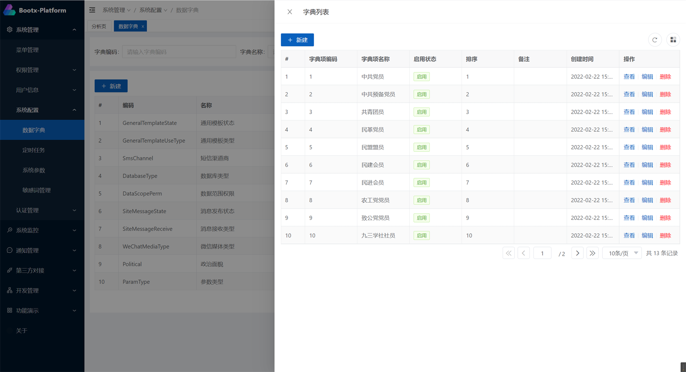

# 数据字典
分为字典和字典项两级，通过字典编码和字典项编码可以确定唯一的一项字典值，字典编码互相不可以重复，同一个字典项的字典项编码互相也不可用重复，
不同字典下的字典项编码可以重复。通常是用于前端使用，。

## 字典


**核心字段**

| 字段名      | 类型      | 描述   |
|----------|---------|------|
| name     | string  | 字典名称 |
| code     | string  | 字典编码 |
| groupTag | string  | 分类标签 |
| enable   | boolean | 是否启用 |

**特点**

- 字典编码为唯一，不可以重复，用来表示某一类字典项的集合。
- 字典名称用于前端展示，如：性别、民族、登录方式等。
- 字典项的分类标签，用于前端展示，如：系统设置、权限设置等。
- 字典项的enable字段，用表示是否启用，不启用的情况下，将不对字典值进行翻译。

## 字典项


**核心字段**

| 字段名      | 类型      | 描述   |
|----------|---------|------|
| dictCode     | string  | 字典编码 |
| code     | string  | 字典项编码 |
| name     | string  | 字典项名称 |
| enable   | boolean | 是否启用 |

**特点**

- 字典项编码在同一个字典下唯一，不可以重复
- 字典项名称用于前端展示，如：男、女等。
- 字典项的enable字段，用表示是否启用，不启用的情况下，将不对字典值进行翻译。

## 翻译注解
::: warning
设计开发中，未定版
:::

## 前端使用
- 在系统打开时缓存字典数据，减少对后端的请求次数
- 根据字典CODE值获取字典项列表，提供同步和异步的方法
- 字典项翻译，将code码转换成显示的值
- 获取下拉列表，快速提供给`Select`组件使用

**导入useDict**
```typescript
import { useDict } from '/@/hooks/bootx/useDict'
// 引入对应的方法
const { dictConvert } = useDict()

```
**方法介绍**
> 有时候在页面F5刷新时，页面加载完毕时，字典项尚未初始化加载完成，这个问题暂时没太好的办法，为了解决这个文件，我们可以使用异步方法。
> 如果未获取到字典项，将会触发一次字典项初始化操作并阻塞，在初始化操作执行成功后，再返回对应的结果，即字典列表

- `dictConvert (dictCode, code):string` 字典项转换，将code码转换成显示的值
- `dictDropDown (dictCode):` 异步获取字典项下拉列表列表
- `dictDropDownNumber (dictCode):` 异步获取字典项列表，code值会被转换成数字类型

**返回数据结构**

```json
[
  {
    "code": "1",
    "name": "男",
    "dictCode": "sex"
  }
]
```
**使用示例**

获取拉下列表

```typescript
// 初始化角色下拉菜单
sexList = await dictDropDownNumber('Sex')
```

对列表字段进行字典翻译

```vue
<vxe-table row-id="id" ref="xTable" :data="pagination.records" :loading="loading">
  <vxe-column type="seq" title="序号" width="60" />
  <vxe-column field="birthday" title="生日" />
  <vxe-column field="political" title="政治面貌">
    <template #default="{ row }">
      {{ dictConvert('Political', row.political) }}
    </template>
  </vxe-column>
  <vxe-column field="remark" title="备注" />
</vxe-table>
```
**对应pinia**

```typescript
import { useDictStore } from '/@/store/modules/dict'

const dictStore = useDictStore()
```