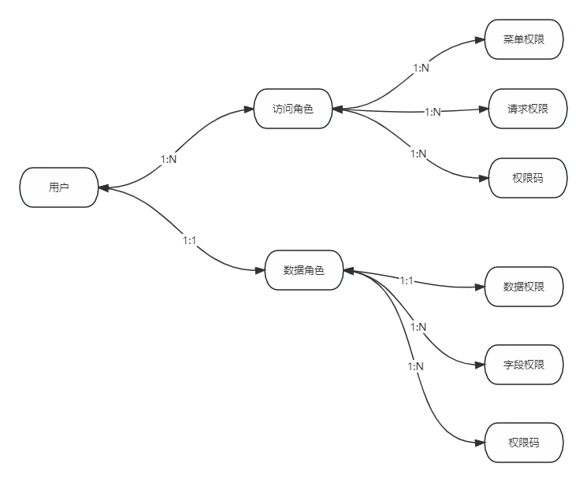

# 权限体系

## 基于RBAC的权限体系
RBAC(Role-Based Access Control),即基于角色的访问控制。Bootx的权限体系就是基于RBAC的，在RBAC中，权限与角色关联，角色再与权限关联，
用户通过其拥有的角色而拥有该角色对应的权限。采用该手段可极大的简化权限的管理，管理的层级相互依赖，我们只需要关注权限是否赋予了角色，
而用户是否拥有目标权限的角色即可，只要对应的权限给予了角色且该角色赋予了对应的用户，那么该用户就能拥有那个权限。层层递进，管理起来很方便，也较为清晰。
因此，关于权限与用户之间的关联关系，我们只需要注重于他们之间的桥梁：角色。因为用户与权限的关联是通过角色挂钩的，只要维护好权限与角色的关系，
角色与用户的关系，那么我们是可以大幅度的降低由于操作失误导致的权限问题。

## 访问角色
> 主要控制所能访问的页面和接口，以及可以进行的操作，例如：某个角色只能访问某个页面和页面对应的操作按钮，某个角色只能访问某个接口，某个角色只能访问某个接口的某个操作。
## 数据角色
> 主要用于控制所能访问的数据范围，比如：某个角色只能访问某个表的数据，某个角色只能访问某个表的某些字段，
## 菜单权限

## 访问权限
> 访问权限是针对请求的权限，比如：用户请求某个接口，需要什么权限才能访问。要实现这种权限，目前系统中有两种方式：可视化配置和代码配置，
> 代码配置借助注解和权限码实现，可以视情况进行使用，两者可以同时使用，只要满足任意一种方式请求就可放行。

## 数据权限
> 用来控制哪些数据是用户可以访问的，主要分为两类：可查看的数据范围和可查看的数据字段，字段权限在下个环节进行介绍。

数据权限是为了解决不同级别的用户或角色可以查询到数据范围的不同，比如：
管理员可以查看到所有的订单，某个销售人员只能看到其负责的来源公司的订单，客户业务人员仅能看到自己创建的订单，采购人员仅能看到某些类型的订单。
也就是针对不同的用户或者角色对某一业务功能做不同维度的动态权限控制。

## 字段权限
字段权限的诞生是为了解决我们需要动态控制某些数据字段的屏蔽情况。常见的业务场景有：
假设一个系统中有一系列订单，订单表里有订单相关的订单号，业务类型，来源，订单金额，联系方式等字段，不同的角色或者用户拥有查询不同字段的权限，
业务员只能查看订单号和业务类型，部门经理可以查看订单号，来源，订单金额，而总经理可以查看全部，

## 权限码
> 权限码是权限的标识，权限码是权限的唯一标识，它的适用范围比较广泛，访问权限可以用它来进行控制，数据字段权限可以用它来进行控制，
> 页面元素是否可以操作和查看也可以用它来进行控制。