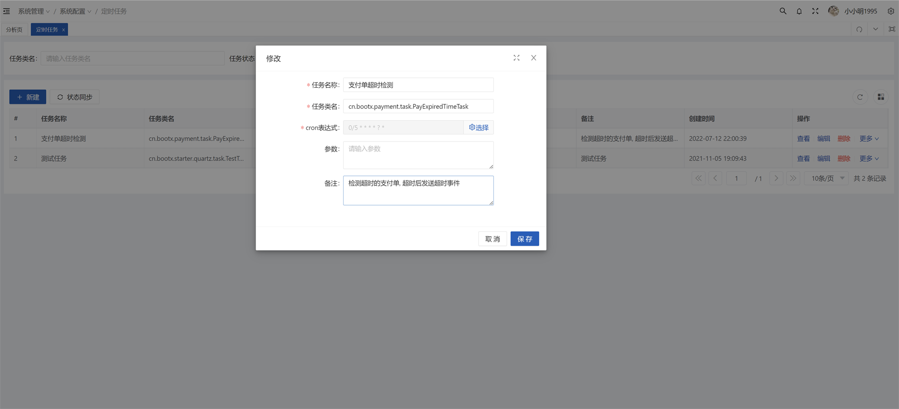

# 定时任务

## 功能
- 封装Quartz定时任务，可以通过web界面来控制执行
- 通过标注注解来进行自动记录执行日志

## 截图

## 使用
自定义`Job`任务类，然后在Web管理页面上添加该任务并启动。
> `Job`任务类可以正常注入Spring Bean对象，Quartz具体使用查看官方教程

```java
/**
 * 测试定时任务
 * @author xxm
 * @date 2021/11/8 
 */
@Slf4j
@Component
@DisallowConcurrentExecution
@PersistJobDataAfterExecution
@RequiredArgsConstructor
public class TestTask implements Job {
    /**
     * 若参数变量名修改 QuartzJobScheduler 中也需对应修改
     * 需要给一个set方法, 让系统设置值
     */
    @Setter
    private String parameter;

    @Override
    public void execute(JobExecutionContext context) {
        log.info("定时任务start");
        ThreadUtil.safeSleep(5000L);
        log.info("定时任务end");
        log.info("参数: {}",parameter);
    }
}
```
**配置文件**
```yaml
quartz:
  # 持久化方式
  job-store-type: jdbc
  #定时任务启动开关，true-开  false-关
  auto-startup: true
  #启动时更新己存在的Job
  overwrite-existing-jobs: true
  properties:
    org:
      quartz:
      	# 执行器
        scheduler:
          # 执行器名称
          instanceName: quartzScheduler
          # id配置
          instanceId: AUTO
        # 线程池
        threadPool:
          threadCount: 10
          threadPriority: 5
          threadsInheritContextClassLoaderOfInitializingThread: true
```
## 记录日志
在定时任务的执行类上标注`JobLog`注解，就可以开启自动保存执行日志的功能，将会记录下定时任务执行时的信息，其中有两个参数可以配置：
- `log` 是否记录正常日志，默认为`true`
- `errorLog` 是否记录异常日志，默认为`true`

## 相关类
- `QuartzJobScheduler` 定时任务调度器
- `JobLogAspectHandler` 定时任务日志切面

